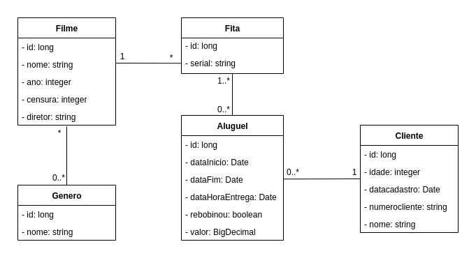

# Locadora de Fitas VHS

Devido à grande demanda causada por saudosistas dos anos 90, um de nossos clientes decidiu abrir uma
locadora de fitas de vídeo e nos encomendou um sistema para gerí-la.

Este sistema consiste em um App mobile e um backend em Java usando Spring Boot 😍 que 
implementa uma API RESTful responsável por fornecer os dados para o App.

Nesta primeira Sprint de desenvolvimento do backend você DEVe:

1. Completar as classes, suas associações e mapeamentos de acordo com o diagrama de classes anexo ao projeto.

2. Alterar o endpoint GET de busca por Filmes para aceitar buscas pelo Genero.

3. Criar um endpoint GET que retorne se o Filme possui alguma Fita disponível (use as datas presentes na entidade para saber).

4. Criar um endpoint POST que realize o Aluguel de um Filme. 

